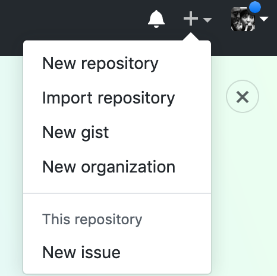
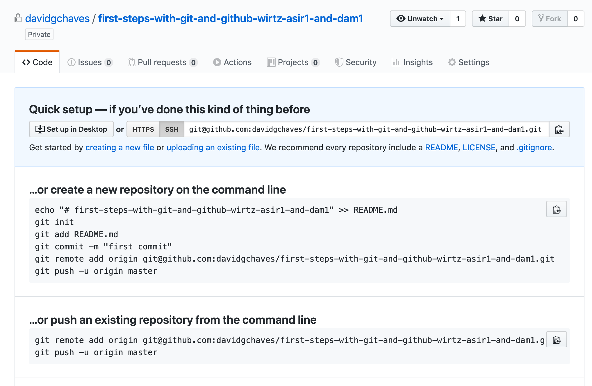

# Primeros pasos con git y github

## Índice

- [Primeros pasos con git y github](#primeros-pasos-con-git-y-github)
  - [Índice](#Índice)
  - [Consideraciones previas](#consideraciones-previas)
  - [Receta 0](#receta-0)
  - [Receta 1](#receta-1)
    - [1 Crear un repositorio en GitHub](#1-crear-un-repositorio-en-github)
    - [2 Introducir los datos que nos piden](#2-introducir-los-datos-que-nos-piden)
    - [3 Crear una carpeta para el repositorio en la máquina local](#3-crear-una-carpeta-para-el-repositorio-en-la-máquina-local)
    - [4 Crear el repositorio localmente y enviarlo a Github](#4-crear-el-repositorio-localmente-y-enviarlo-a-github)

## Consideraciones previas

Las líneas que debemos escribir en la ventana de comandos son las que van despues de un `❯ ` sin el `❯ `.

Por tanto si vemos 👇

```sh
❯ pwd
/Users/davidgchaves/proyects
```

debemos escribir, simplemente 👇

```sh
pwd
```

## Receta 0

> Instalar git en Ubuntu

En una ventana de comandos ejecutamos, uno tras otro, los 3 comandos siguientes 👇

```sh
❯ sudo add-apt-repository ppa:git-core/ppa
❯ sudo apt update
❯ sudo apt install git
```

Comprobamos que todo ha ido bien y que nuestro sistema reconoce `git` 🎉🚀⚡️

```sh
❯ git --version
git version 2.20.1 (Apple Git-117)
```

**NOTA**: He ejecutado `git --version` en un OS X y no en un Linux... de ahí el resultado.

## Receta 1

> Crear un repositorio GitHub y asociarlo al repositorio que tengamos en la máquina local

### 1 Crear un repositorio en GitHub

Usar la opción **New Repository** del menu 👇



### 2 Introducir los datos que nos piden

Nombre, descripción y determinar si va a ser privado o público.

### 3 Crear una carpeta para el repositorio en la máquina local

En el caso de este repositorio, para crear la carpeta debemos primero comprobar que nos encontramos en el directorio correcto `projects`👇

```sh
❯ pwd
/Users/davidgchaves/proyects
```

Para a continuación crear el directorio...

```sh
❯ mkdir first-steps-with-git-and-github-wirtz-asir1-and-dam1
```

...y entrar en el

```sh
❯ cd first-steps-with-git-and-github-wirtz-asir1-and-dam1/
```

Finalmente volvemos a comprobar que estamos donde debemos estar

```sh
❯ pwd
/Users/davidgchaves/proyects/first-steps-with-git-and-github-wirtz-asir1-and-dam1
```

### 4 Crear el repositorio localmente y enviarlo a Github

Debemos seguir las instrucciones que nos da Github. En concreto las de **_…or create a new repository on the command line_**

En el caso de este repositorio, he ampliado algo las instrucciones para que nos resulte más sencillo entender qué estamos haciendo en cada momento. A continuación las lineas de comandos y sus respuestas. Tened en cuenta que las **vuestras pueden variar**.

Creamos el fichero vacio (`touch`) `README.md`

```sh
❯ touch README.md
```

Inicializamos (`init`) el repositorio en nuestra máquina

```sh
❯ git init
Initialized empty Git repository in /Users/davidgchaves/proyects/first-steps-with-git-and-github-wirtz-asir1-and-dam1/.git/
```

Consultamos el estado (`status`) del repositorio

```sh
❯ git status
On branch master

No commits yet

Untracked files:
  (use "git add <file>..." to include in what will be committed)

	README.md

nothing added to commit but untracked files present (use "git add" to track)
```

Añadimos el `README.md` vacío al _stage_ (`add`) para que `git` sea consciente de su existencia y de que queremos seguirlo (`add`) y posteriormente salvarlo (`commit`)

```
❯ git add README.md
```

Consultamos el estado (`status`) para ver qué ha cambiado y comprobamos que, efectivamente, `git` ya sigue a `README.md`

```sh
❯ git status
On branch master

No commits yet

Changes to be committed:
  (use "git rm --cached <file>..." to unstage)

	new file:   README.md

```

Salvamos (`commit`) nuestra primera versión con un mensaje

```sh
❯ git commit -m "First commit"
[master (root-commit) 3838d0e] First commit
 1 file changed, 0 insertions(+), 0 deletions(-)
 create mode 100644 README.md
```

Volvemos a comprobar el estado (`status`) del repositorio y vemos que no hay nada que hacer

```sh
❯ git status
On branch master
nothing to commit, working tree clean
```

Consultamos el historial de versiones actual (`log`) y comprobamos que tenemos nuestra primera versión (`commit`).

```sh
❯ git log
3838d0e First commit (David G Chaves, 3 minutes ago)
```

**NOTA**: En mi caso salen menos datos que en el vuestro porque tengo la siguiente linea en mi `.gitconfig` 👇 (que podeis añadir al vuestro, si quereis)

```
[format]
	pretty = %C(yellow)%h%Creset %s %C(red)(%an, %cr)%Creset
```

Insertamos un título al `README`

```sh
❯ echo "# first-steps-with-git-and-github-wirtz-asir1-and-dam1" >> README.md
```

Comprobamos que ha cambiado el contenido del `README`

```sh
❯ cat README.md
# first-steps-with-git-and-github-wirtz-asir1-and-dam1
```

Volvemos a comprobar el estado (`status`) del repositorio y vemos que nos dice que hay cambios listos para enviar al `stage` (`add`)

```sh
❯ git status
On branch master
Changes not staged for commit:
  (use "git add <file>..." to update what will be committed)
  (use "git checkout -- <file>..." to discard changes in working directory)

	modified:   README.md

no changes added to commit (use "git add" and/or "git commit -a")
```

Añadimos los cambios selectivamente (`add -p`)

```sh
❯ git add -p
diff --git a/README.md b/README.md
index e69de29..82f4a78 100644
--- a/README.md
+++ b/README.md
@@ -0,0 +1 @@
+# first-steps-with-git-and-github-wirtz-asir1-and-dam1
Stage this hunk [y,n,q,a,d,e,?]? y
```

Volvemos a comprobar el estado (`status`) del repositorio y vemos que ahora sí hay cambios listos para ser salvados (`commit`).

```sh
❯ git status
On branch master
Changes to be committed:
  (use "git reset HEAD <file>..." to unstage)

	modified:   README.md
```

Salvamos (`commit`) nuestra segunda versión con un mensaje

```sh
❯ git commit -m "Add title to README"
[master 6678c20] Add title to README
 1 file changed, 1 insertion(+)
```

Volvemos a comprobar el estado (`status`) del repositorio y vemos que no hay nada que hacer

```sh
❯ git status
On branch master
nothing to commit, working tree clean
```

Consultamos el historial de versiones actual (`log`) y vemos que hay 2 versiones (o `commit`s) de nuestro repositorio.

```sh
❯ git log
6678c20 Add title to README (David G Chaves, 68 seconds ago)
3838d0e First commit (David G Chaves, 14 minutes ago)
```

Todos estos **cambios** han ocurrido en **nuestra máquina local**, **GitHub no sabe nada** todavía. Ahora vamos a _enganchar_ nuestro repositorio local con el repositorio creado antes en GitHub.

Añadimos un _remoto_ (`remote`) con la dirección de nuestro repositorio en GitHub

```
❯ git remote add origin git@github.com:davidgchaves/first-steps-with-git-and-github-wirtz-asir1-and-dam1.git
```

En el código de 👆, en vuestro caso cambiará el repositorio `git@github.com:davidgchaves/first-steps-with-git-and-github-wirtz-asir1-and-dam1.git` que será algo así como `git@github.com:USUARIO/NOMBRE_REPO.git`.

Tras añadir el remoto (`remote`), nuestra máquina local **ya sabe** a dónde enviar los cambios. Es decir, ya sabe cual es el repositorio de Github. De hecho, la convención que se usa es llamar `origin` al repositorio de Github. Por eso el

```
origin git@github.com:USUARIO/NOMBRE_REPO.git
```

Ahora vamos a enviar los datos a Github (`push`) por primera vez

```sh
❯ git push -u origin master
Enter passphrase for key '/Users/davidgchaves/.ssh/id_rsa':
Enumerating objects: 6, done.
Counting objects: 100% (6/6), done.
Delta compression using up to 4 threads
Compressing objects: 100% (3/3), done.
Writing objects: 100% (6/6), 488 bytes | 488.00 KiB/s, done.
Total 6 (delta 0), reused 0 (delta 0)
To github.com:davidgchaves/first-steps-with-git-and-github-wirtz-asir1-and-dam1.git
 * [new branch]      master -> master
Branch 'master' set up to track remote branch 'master' from 'origin'.
```

👆 Como yo tengo un `passphrase` para mi clave `ssh`, me la pide. En clase **NO** establecimos ningún `passphrase` por comodidad, por lo que no debería pedírosla. Aun así **ES RECOMENDABLE** establecer un `passphrase` para las claves `ssh`.

Si ahora voy a la dirección de Github en la que está mi repositorio debería cambiar de esto 👇



a esto otro 👇


A partir de ahora cada vez que queramos enviar los datos a Github bastará con `git push` a secas.

```sh
❯ git push
```
