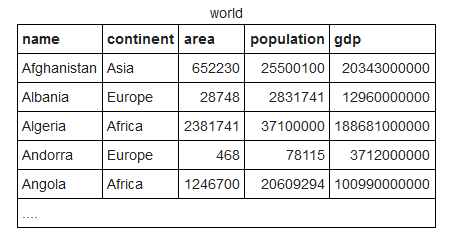

# Apuntes de SQL :notebook:

## **Historia**

- [Qué es una BBDD y SQL](https://www.youtube.com/watch?v=FR4QIeZaPeM "DDBB & SQL")
- [Historia de SQL](https://es.wikipedia.org/wiki/SQL "Historia de SQL en Wikipedia")
- [Ejemplos de los apuntes](https://sqlzoo.net/ "Ejemplos en SQLZoo")

## **Sublenguajes de SQL**

SQL es un único lenguaje compuesto de sublenguajes que pueden realizar por separado o conjuntamente con otros sublenguajes distintas operaciones que el usuario le pida. 

Estos sublenguajes son: 

- **`DQL (Data Query Language)`**: Este sublenguaje se encarga de las consultas de los usuarios (obtener las columnas -atributos- de una tabla, obtener tuplas con información de una columna o la tabla al completo...).
  - **`SELECT`**
- **`DML (Data Manipulation Language)`**: Este sublenguaje se encarga de manipular los datos de la base de datos. Permite, por ejemplo, insertar nuevos datos en una columna.
  - **`INSERT, UPDATE, DELETE` -> En versiones anteriores de SQL incluía `SELECT`**
- **`DDL (Data Definition Language)`**: Este sublenguaje nos permite definir las características u objetos de la base de datos. Con este sublenguaje podemos, por ejemplo, crear o eliminar tablas.
  - **`CREATE, ALTER, DROP, TRUNCATE, RENAME`**
- **`DCL (Data Control Language)`**: Permite definir controles de seguridad sobre datos u objetos de la base de datos. Con este sublenguaje se puede dar o revocar permisos a los usuarios para que puedan o no acceder a ciertos datos o realizar alguna operación.
  - **`GRANT, REVOKE`**
- **`TCL (Transaction Control Language)`**: Nos permite hacer transacciones (conjunto de operaciones sobre datos u objetos).
  - **`COMMIT, ROLLBACK, SAVEPOINT`**
- **`SCL (Session Control Language)`**: Permite manejar de manera dinámica la sesión de un usuario. La sesión de un usuario se entiende como la representación lógica de una conexión entre la base de datos y un usuario. Con este lenguaje se puede modificar condiciones o parámetros de una sesión activa.
  - **`ALTER SESSION, SET ROLL`**

## DQL (Data Query Language)

El sublenguaje DQL nos permite obtener datos de una base de datos mediante consultas a ésta. Podemos utilizarlo para saber, por ejemplo, los nombres de los países de una supuesta tabla llamada 'world', que contiene todos los países del mundo.

Las consultas que podemos hacer consisten en una combinación de su principal función, `SELECT`, y la función `FROM`, con la que indicamos desde qué tabla queremos sacar los datos que queremos y que previamente hemos indicado en el `SELECT`. Sólo con éstas dos funciones podemos obtener infinidad de datos de un BBDD, aunque al final se quedan cortas para los numerosos casos en los que queremos consultar, por ejemplo, datos que cumplan un cierto criterio. Para éstos casos podemos combinar las funciones anteriores con la función `WHERE`, que nos permite indicar una condición (o varias) que deben cumplir los datos que queremos, y ésto se lo indicamos en forma de predicados.

Supongamos la siguiente tabla de una BBDD de ejemplo tomada de [SQLZoo](https://sqlzoo.net/ "SQLZoo"):



La tabla está compuesta de cinco columnas **(name, continent, area, population y gdp)** y contiene tuplas de información relacionada con la semántica de ésas columnas. Si quisiéramos saber, por ejemplo, todos los países de África, lo primero que haríamos sería seleccionar los datos que queremos (en este caso **name**), luego de dónde lo queremos (estamos trabajando con la tabla '**world**' así que la elegimos) y finalmente le decimos que queremos los países que esten en el continente africano (este es el predicado). La consulta quedaría así:

```sql
SELECT name
FROM world
WHERE continent = 'Africa';
--Utilizamos el comparador '=' para comprobar que continent es exactamente igual a 'Africa'
```

* Las consultas SQL siempre acaban en **;**.
* Para poner comentarios de una línea utilizamos doble guión: --COMENTARIO y para los de varias líneas los encerramos en barra y asterisco: 

```
/*
COMENTARIO 1
COMENTARIO 2
COMENTARIO 3
...
*/
```

Si queremos, por ejemplo, saber a qué continente pertenece Australia y sabemos que está en una lista dada de continentes utilizamos la cláusula **`IN`**:

```sql
SELECT name, continent
FROM world
WHERE name = 'Australia' AND continent IN ('Africa', 'Oceania', 'Asia');
```

* Podemos selccionar varias columnas de una tabla simplemente separando sus nombres por comas.
* Para concatenar predicados utilizamos la cláusula **`AND`**.
